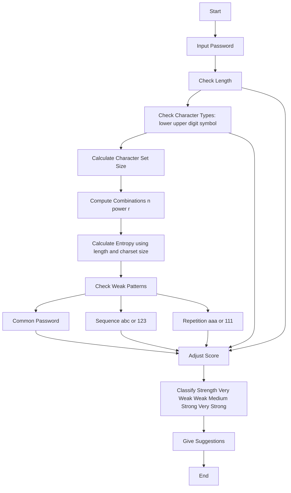

```mermaid
flowchart TD
    A[Start] --> B[Input Password]

    B --> C[Check Length]

    C --> D[Check Character Types: lower upper digit symbol]

    D --> E[Calculate Character Set Size]

    E --> F[Compute Combinations n power r]

    F --> G[Calculate Entropy using length and charset size]

    G --> H[Check Weak Patterns]

    H --> H1[Common Password]
    H --> H2[Sequence abc or 123]
    H --> H3[Repetition aaa or 111]

    H1 --> I[Adjust Score]
    H2 --> I
    H3 --> I

    C --> I
    D --> I

    I --> J[Classify Strength Very Weak Weak Medium Strong Very Strong]

    J --> K[Give Suggestions]

    K --> L[End]
```
